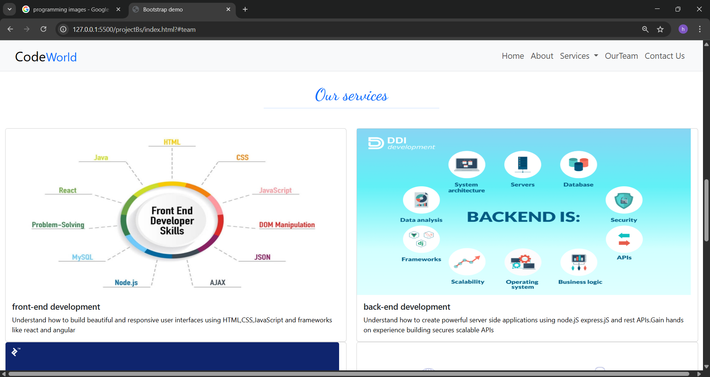
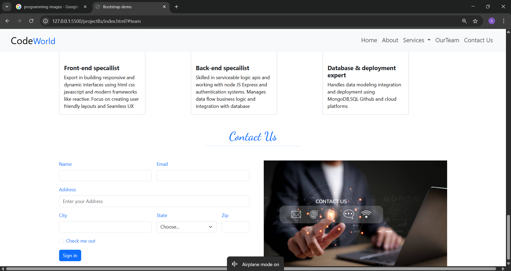

 Full‑Stack Developer Road Map
A responsive, informative roadmap built using Bootstrap—designed for aspiring full‑stack developers. Covers key technologies and concepts across front-end, back-end, database, deployment, and developer tools. 

🚀 Project Overview
This project visually outlines the essential learning path for anyone aiming to become a competent full-stack developer. It highlights the core technologies and tools needed—from UI basics to deployment strategies. 
![Website Preview]

🎨 Build & Design
Built using Bootstrap for a clean, responsive layout.

HTML-driven, with structured sections showcasing frontend, backend, database, deployment, and developer tools.

Minimal CSS styling focused on readability and accessibility.

Usage Instructions
Clone the repository:

git clone https://github.com/Harshitha-Nuthikadi/full-stack-developer-road-map.git

Navigate to the folder:

cd full-stack-developer-road-map
Open index.html in any browser to view the roadmap.

No server or build tools required; just browser access.

🔍 Why It’s Useful
Provides a clear, visual learning path for beginners in full-stack development.

Highlights technologies across multiple layers: front-end, back-end, DB, deployment.

Perfect for students or self-learners looking for structured guidance.

